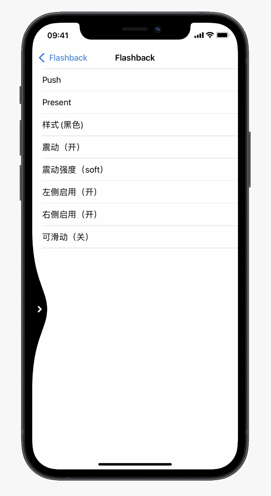
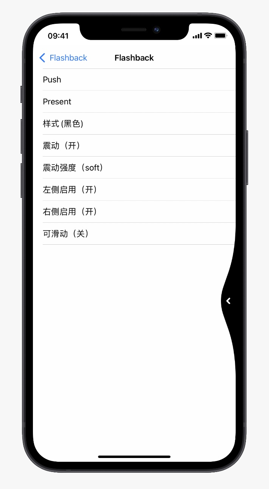

# Flashback - iOS手势返回

[](https://cocoapods.org/pods/Flashback)
[](https://cocoapods.org/pods/Flashback)
[](https://cocoapods.org/pods/Flashback)
[](https://cocoapods.org/pods/Flashback)
[](https://cocoapods.org/pods/Flashback)

## 效果图
<table>
    <tr>
        <td></td>
        <td></td>
    </tr>
</table>

## 前言

iOS的侧滑手势返回很难用有木有，而且只能从左侧返回，因为不是系统级别，也不是强制使用，还有很多App还不支持，只能羡慕Android的手势返回。为了解决该问题而制作的该库，还是希望苹果有一天能够带来系统级别的手势返回。

## Demo

To run the example project, clone the repo, and run `pod install` from the Example directory first.

## Install

Flashback is available through [CocoaPods](https://cocoapods.org). To install
it, simply add the following line to your Podfile:

```ruby
pod 'Flashback'
```

## Get start

1. 启用（必要）

```swift
import Flashback

FlashbackManager.shared.isEnable = true
// 指定目标window（有默认值）
FlashbackManager.shared.targetWindow = window

// 禁用系统提供的手势返回
navigationController?.interactivePopGestureRecognizer?.isEnabled = false
```


2. 可配置

```swift
var config = FlashbackConfig.default
// 左右侧启用
config.enablePositions = [.left, .right]
// 触发范围
config.triggerRange = 20
// 震动启用
config.vibrateEnable = true
// 震动强度
config.vibrateStyle = .light
// 指示器样式
config.style = .custom
// 指示器背景颜色
config.backgroundColor = .black
// 指示器图片颜色
config.indicatorColor = .yellow
// 上下滚动开启
config.scrollEnable = true
// 震动启用
config.vibrateEnable = true
// 震动强度
config.vibrateStyle = .light
// 忽略顶部高度(顶部不可侧滑返回)
config.ignoreTopHeight = 150
// ...
FlashbackManager.shared.config = config
```


3. 可重写返回逻辑

```swift
extension ViewController {
    /// 重写返回
    override func onFlashBack() {
        // super.onFlashBack()
        self.view.endEditing(true)
    }
}
```

4. 可前置处理（统一处理弹窗，减少代码侵入）
```swift
// 举例：判断VC上的视图是否满足某个协议，若满足，则执行其返回方法
// 不是一定要满足FlashbackProtocol协议，你可以选择自己的协议，更好的减少代码侵入
FlashbackManager.shared.preFlashback = {
    // 返回true继续向下执行正常逻辑，返回false终止
    if let alertList = FlashbackManager.shared.currentVC()?.view.subviews.filter({ $0 is FlashbackProtocol }),
        let lastAlert = alertList.last as? FlashbackProtocol {
        lastAlert.onFlashback()
        // 返回false不再继续往下执行
        return false
    }
    // ...
    
    // 返回true继续正常执行
    return true
}

// 扩展视图实现协议
extension AlertView: FlashbackProtocol {
    /// 弹窗闪回扩展
    open func onFlashback() {
        self.dismiss()
    }
}

```

5. 可自定义返回栈（页面弹框...）
```swift
let alert = AlertView()
alert.show()
// 请注意alert为weak, 否则会因强应用，而导致对象无法释放
FlashbackManager.shared.addFlahback(alert) { [weak alert] in
    guard let `alert` = alert else { return true }
    alert.dismiss()
    return true
}
```

**注意说明**：
- 在`backMode`为`normal`时，执行顺序为：`preFlashback` -> `backStack` -> `UIViewController(pop | dismiss)`，所以如果弹窗后，弹窗不消失，再弹出`UIViewController`，会出现问题
- 若`target`为`nil`，则会移除顶项，递归继续执行返回，闭包返回为`true`时执行完移除，为`false`不移除。
- 一定要注意`target`的生命周期，若`target`产生强应用未被及时释放，则会导致返回出错。若您的`target`不需要被释放，您可以选择在它消失时手动调用`FlashbackManager.shared.backStack.removeLast()`

6. 可通知返回，您可以全权接管返回逻辑
```swift
// 设置返回模式为通知
FlashbackManager.shared.config.backMode = .notify

// 通知回调
NotificationCenter.default.addObserver(forName: FlashbackManager.FlashbackNotificationName, object: nil, queue: nil) { [weak self] _ in
    guard let `self` = self else { return }
    // 执行返回逻辑
    // self.navigationController?.popViewController(animated: true)
}
```

## Existing problems

1. 左右两侧有一部分像素用于了侧滑返回判断，所以不可点击，可通过修改triggerRange来改变触发范围大小。

## Author

可通过邮件的方式联系我： 664454335@qq.com

## License

Flashback is available under the MIT license. See the LICENSE file for more info.
